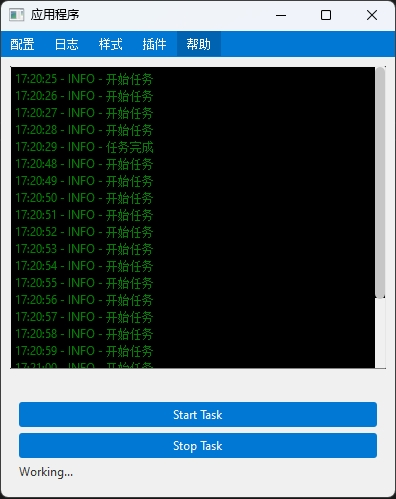

# Py-Modular-GUI


## 项目简介
**Py-Modular-GUI** 是一个基于 **Python + PySide2** 的图形用户界面，旨在快速开发和交付基于 Python 的 GUI 应用程序。该项目利用 [PyStand](https://github.com/skywind3000/PyStand) 打包方式对应用进行分发。

## 功能特性
- **模块化设计**：支持插件机制，用户可以轻松添加或移除功能模块。
- **易于使用**：提供基础模板，开发者专注于插件开发。
- **日志记录**：内置日志系统，方便调试和监控应用状态。
- **插件管理**：集成插件管理，可在线安装、在线升级。
- **包管理**：根据插件需要，自动实现包管理。
- **样式管理**：样式文件夹 `resources/qss`，可动态切换。

## 插件开发指南
1. 确保已安装 **Python 3.8 32位版本**（保证兼容性，实践中发现64位分发后大部分电脑不能正常使用，报 dll 缺失）。
2. 克隆项目：
   ```bash
   git clone https://github.com/aduuuu213/Py-Modular-GUI
   cd Py-Modular-GUI
   ```
3. 使用以下命令安装依赖：
   ```bash
   pip install -r requirements.txt
   ```
4. 根据 demo 创建新插件，完善信息`__init__.py`、`info.json`：
   ```Python
   PLUGIN_INFO = {
      'name': '演示插件',  # 插件别名 显示在插件管理的文本
      'version': '0.0.1',    # 当前插件的版本号
      'description': '这是一个示例插件，旨在展示插件的基本功能和结构。',  # 插件的描述
      'update_url': 'http://example.com/package/demo/info.json'  # 插件是否有新版本的获取地址
   }
   ```
   **update_url** 应返回如下格式，实现插件在线安装，自动包管理
   ```python
   {
    "plugin_name": "demo",  # 对应插件文件名的 如：demo
    "name": "演示插件", # 插件的中文名称
    "version": "0.0.1", # 最新版本号
    "description": "这是一个示例插件，旨在展示插件的基本功能和结构。", # 介绍
    "download_url": "http://example.com/package/demo/demo_0.0.1.zip", # 下载地址
    "release_notes": "'测试自动打包更新'", # 本次更新的内容
    "min_app_version": "1.0", # 主app的版本号
    "dependencies": {  # 使用插件需要的包，程序会自动调用pip 进行安装，版本号可为空
        "requests": "1.0",
        "flask": '2.0'
      }
   }
   ```
5. 开发你的插件

## 插件打包与分发
#### 离线分发
1. 插件开发完成后，可直接分发源码或使用 **Nuitka** 对源码进行模块化打包后分发：
   ```bash
   cd plugins   # 进入插件目录
   nuitka --module demo --include-package=demo   # demo 为插件文件夹名称
   ```
2. 打包后的文件名：`demo.cp38-win32.pyd`
3. 重命名为：`demo.pyd` 后，发送给用户放在`plugins`文件夹内使用。
4. 手动将插件需要的包从 `site-packages` 复制到应用相同文件夹下。
5. 具体操作可参考[PyStand](https://github.com/skywind3000/PyStand)
> 这种不能实现自动包管理，建议使用在线安装方式进行分发

#### 在线分发
1. 使用云服务商提供的对象存储进行在线安装。
2. 采用七牛云例子，请预先创建 `BUCKET_NAME`。
3. 修改插件文件信息：`__init__.py` 的 `update_url` 网址。
4. 完善 `auto_package_plugin.py` 文件内的 `AK` `SK` `base_url` `bucket_name`, 运行下面的命令，自动打包并上传到七牛云。
   ```bash
   python auto_package_plugin.py --package_name=demo release_notes='测试自动打包上传'
   ```
5. 将 `update_url` 发送给用户，通过在线安装插件。


## 使用说明
1. 从 **Releases** 下载发布版压缩包。
2. 将插件放入 `plugins` 文件夹。
3. 如果是离线使用，手动将插件需要的包复制到 `site-packages`
4. 通过 **GUI.插件管理** 菜单进行操作，支持多种功能模块的选择和配置。

## 日志记录
应用程序的运行日志将保存在 `logs/app.log` 文件中。可以通过查看该文件来获取应用的运行状态和错误信息。

## 贡献
欢迎提交问题和功能请求，或直接提交代码贡献。请遵循以下步骤：
1. Fork 本项目。
2. 创建功能分支 (`git checkout -b feature/YourFeature`)。
3. 提交更改 (`git commit -m 'Add some feature'`)。
4. 推送到分支 (`git push origin feature/YourFeature`)。
5. 创建 **Pull Request**。


